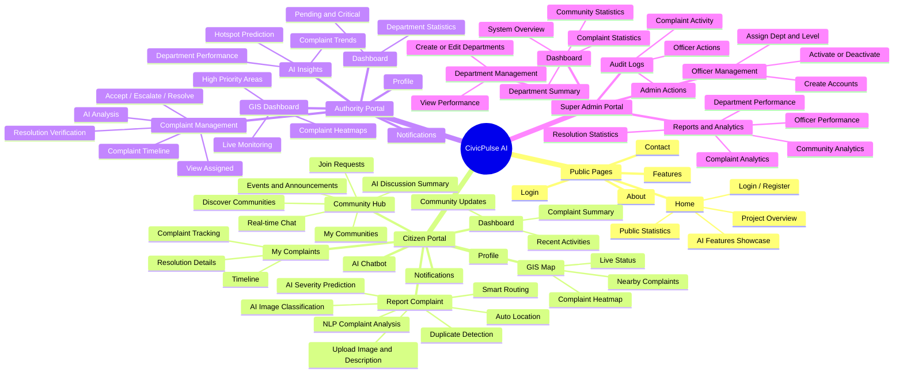

# CivicPulse AI - Architecture & Feature Map

Below is the structured breakdown of the CivicPulse AI application.

---

## 🏗️ Visual Diagram

---

## 📋 Detailed Feature List

### 🏠 Public
- **Home**
  - Project Overview
  - AI Features Showcase
  - Public Statistics
  - Login / Register
- **About**
- **Features**
- **Contact**
- **Login**

### 👥 Citizen Portal
- **Dashboard**: Complaint Summary, Recent Activities, Community Updates.
- **Report Complaint ⭐**: Upload Image & Description, Auto Location (GPS), AI Image Classification, NLP Complaint Analysis, Duplicate Complaint Detection, AI Severity Prediction, Smart Department Routing.
- **My Complaints**: Complaint Tracking, Timeline, Resolution Details.
- **GIS Map**: Nearby Complaints, Complaint Heatmap, Live Complaint Status.
- **Community Hub ⭐**: Discover Communities, My Communities, Join Requests, Real-time Community Chat, Community Events & Announcements, AI Discussion Summary.
- **AI Chatbot**
- **Notifications**
- **Profile**

### 🏛️ Authority Portal
- **Dashboard**: Pending & Critical Complaints, Department Statistics.
- **Complaint Management ⭐**: View Assigned Complaints, Accept / Escalate / Resolve, AI Analysis, Resolution Verification, Complaint Timeline.
- **GIS Dashboard**: Complaint Heatmaps, High Priority Areas, Live Complaint Monitoring.
- **AI Insights**: Complaint Trends, Hotspot Prediction, Department Performance.
- **Notifications**
- **Profile**

### 🛡️ Super Admin Portal
- **Dashboard**: System Overview, Complaint Statistics, Department Summary, Community Statistics.
- **Department Management**: Create / Edit Departments, View Department Performance.
- **Officer Management**: Create Officer Accounts, Assign Department & Level, Activate / Deactivate Officers.
- **Reports & Analytics**: Complaint Analytics, Department Performance, Officer Performance, Community Analytics, Resolution Statistics.
- **Audit Logs**: Complaint Activity, Officer Actions, Admin Actions.